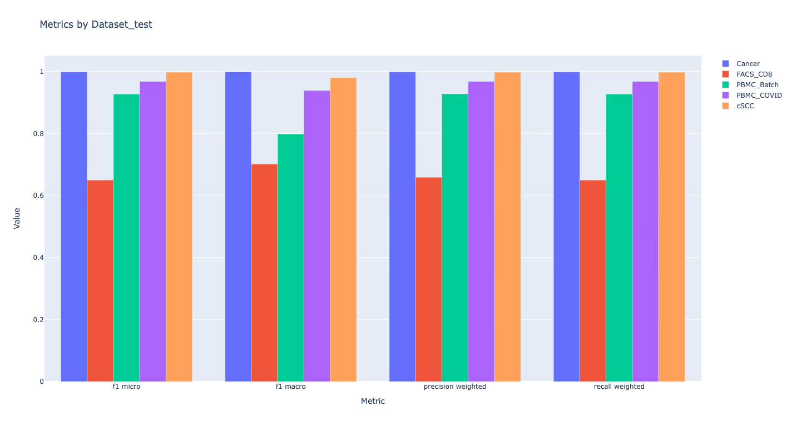

# **Research Proposal**

> **_Trying to solve distribution shift_**

- [**Research Proposal**](#research-proposal)
  - [Requirements](#requirements)
  - [Usage](#usage)
  - [Ideas](#ideas)
  - [Model](#model)
  - [Results](#results)
  - [Issues](#issues)
  - [Further Considerations](#further-considerations)

## Requirements

- [Python 3.11 +](https://www.python.org/downloads/)
- [git](https://git-scm.com/downloads)
- [requirements.txt](requirements.txt)
- Optional
  - [Pycharm](https://www.jetbrains.com/pycharm/download)
  - [Visual Studio Code](https://code.visualstudio.com/Download)

## Usage

- Make sure you've installed git
- Fork this repo
- Make sure that the original **Datasets** folder is in the working directory
- Open your terminal

```bash
git clone https://github.com/{YOURGITHUBID}/OptimizationTheoryProject
cd OptimizationTheoryProject
ls  # or `dir` in windows, the `Datasets` folder should appear
pip install -r requirements.txt -U
pre-commit install
mkdir Models
```

- If you prefer a quick start

```bash
cd fedorAop
python3 main.py
```

- Make your changes, and then

```bash
black .
git add .
git commit -m "YOUR_MESSAGE_HERE"
git push
```

## Ideas

> To train a model that's robust to distribution shift, just train the model under the distribution shift.
>
> Methods to form different types of distribution shifts when training:

- Every time when sampling the dataset to make a batch for training, distribute re-generalized probabilities(weights) to each observation, and sample the dataset
  with these weights. (**_Cor-variate Shift_**)

```python
# generate `size` probabilities with a distribution
m = distribution.rvs(size=size, scale=1/2, *args)
# scale the probabilities to sum them to 1
m = scipy.special.softmax(m)
# choose `batch_size` samples with these probabilities
# False indicates no replacement
choices = np.random.choice(range(len(m)), batch_size, False, m)
# get the batch
sampled_data = data[choices]
```

- When sampling training samples, the labels of a proportion $\lambda$ of the samples are randomly changed, and $\lambda$ is tuned as a hyperparameter. (**_Label Shift_**)

```python
if test_label_shift(train_set, test_set):
  num = np.ceil(batch_size * lamb)
  choices = np.random.choice(range(len(X_batch)), num, False)
  y[choices] = np.random.choice(range(n_features), n_features, True)
```

- When sampling training samples, a proportion $\lambda$ of the samples have random noise added to their feature values, and $\lambda$ is tuned as a hyperparameter. (**_Concept Shift_**)

```python
if test_concept_shift(train_set, test_set):
  num = np.ceil(batch_size * lamb)
  choices = np.random.choice(range(len(X_batch)), num, False)
  for x in X[choices]:
    w = scipy.stats.norm.rvs(size=len(x))
    x += w
```

## Model

> ## _Architecture of Neural Network_
>
> > ### **_Input and Embedding layers_**
> >
> > > **Linear** (`in_features`=n_features, `out_features`=n_features, `bias`=True)
>
> > > **Linear** (`in_features`=n_features, `out_features`=300, `bias`=True)
>
> > ### **_MLP_**
> >
> > > **Linear** (`in_features`=in_features, `out_features`=\_inter_features, `bias`=True)
>
> > > **BatchNorm1d** (`batch_size`=\_inter_features, `eps`=1e-05, `momentum`=0.1, `affine`=True, `    track_running_stats`=True)
> > > **ELU** (`alpha`=1.0)
> > > **Dropout** (`p`=0.5, `inplace`=False)
>
> > > **Linear** (`in_features`=\_inter_features, `out_features`=\_inter_features, `bias`=True)
>
> > > **BatchNorm1d** (`batch_size`=\_inter_features, `eps`=1e-05, `momentum`=0.1, `affine`=True, `track_running_stats`=True)
> > > **ELU** (`alpha`=1.0)
> > > **Dropout** (`p`=0.5, `inplace`=False)
>
> > > **Linear** (`in_features`=\_inter_features, `out_features`=\_inter_features, `bias`=True)
>
> > > **BatchNorm1d** (`batch_size`=\_inter_features, `eps`=1e-05, `momentum`=0.1, `affine`=True, `track_running_stats`=True)
> > > **ELU** (`alpha`=1.0)
> > > **Dropout** (`p`=0.5, `inplace`=False)
>
> > > **Linear** (`in_features`=\_inter_features, `out_features`=n_labels, `bias`=True)
>
> > > **Softmax** (`dim`=1)
> >
> > ### _Optimizer_
> >
> > > **Adam** (`lr=LR`, `betas`=(BETA1, BETA2), `eps`=EPS)
> >
> > ### _LossFuntion_
> >
> > > **CrossEntropyLoss**
> >
> > ### _Learning-rate Scheduler_
> >
> > > **ReduceLROnPlateau** ("min", `patience`=PATIENCE, `threshold`=THRESHOLD)

- `_inter_features` = $\frac 23$ (`in_features`+`out_features`)

## Results




## Issues

- Model generates pretty terribly in "FACS_CD8" dataset currently

## Further Considerations

- Intending to use simpler machine learning models (e.g., regularized linear models) for well-performing datasets and more complex neural network architectures (e.g., incorporating CNN layers) for poorly performing datasets.
- Utilizing the cost function $||Xw - y||^2_2 + \frac \lambda 2 ||w-w_0||^2_2$ and employing the Adam optimizer with Learning Rate Scheduling for gradient descent training of the linear model. This aims to make the weight vector $w$ similar to the result of the previous training in each iteration.
- Planning to adopt a more aggressive sampling strategy.
- Transfer Learning
- Yeo-Johnson Transform (_Preprocessing_)
- Online Machine Learning, e.g. deep-river
- MLP-Mixer
