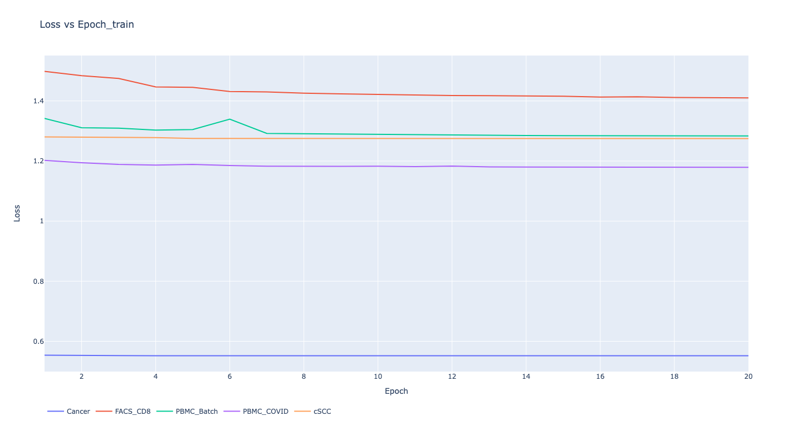
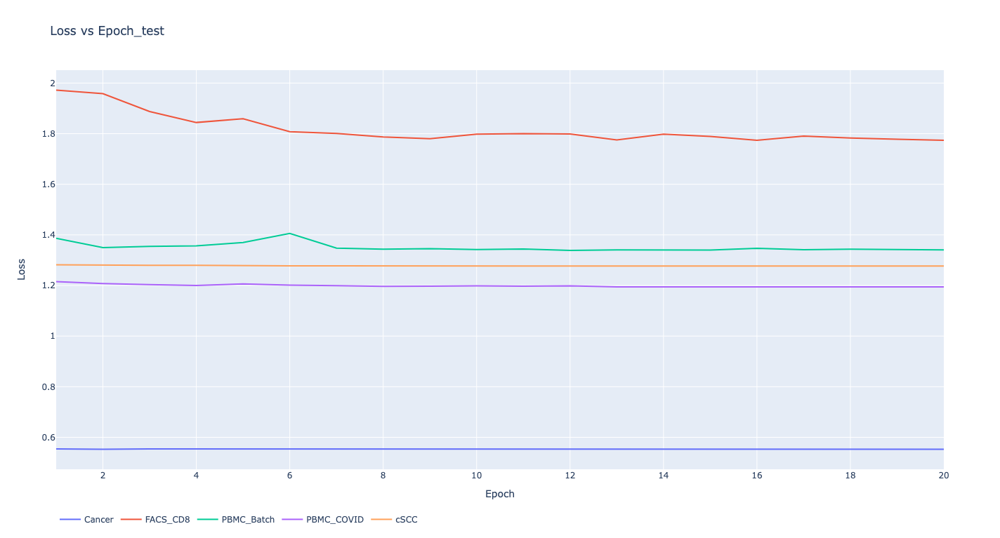
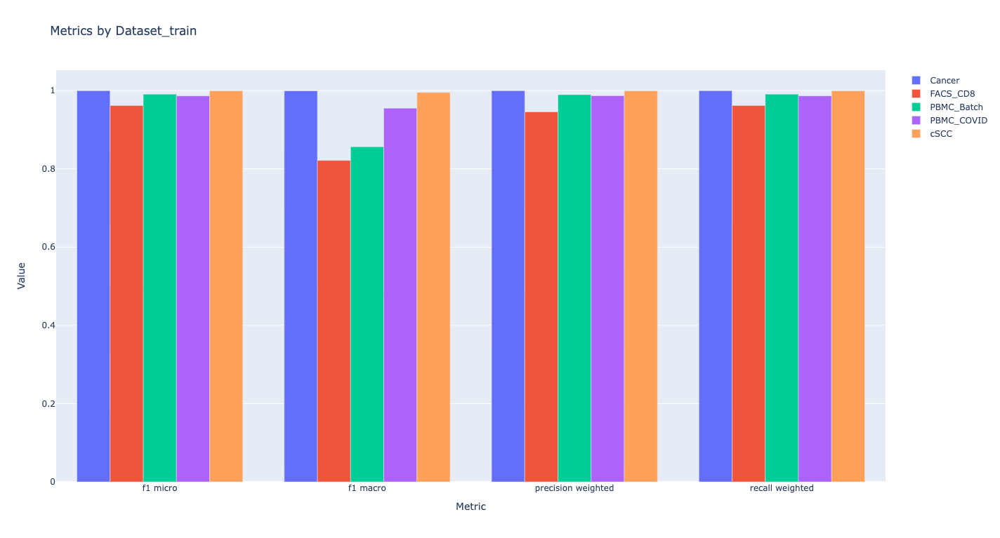
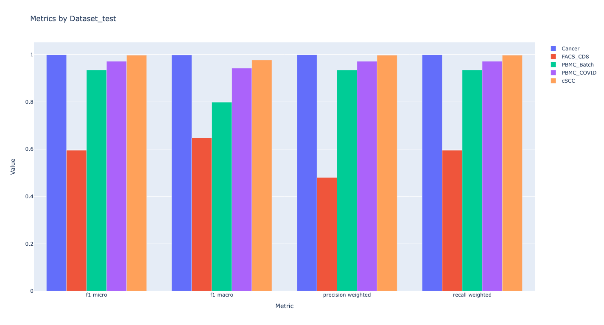

[[toc]]

# **Research Proposal** 

>**_Trying to solve distribution shift_**
## Requirements
 - Python 3.10 +
 - git 
 - requirements.txt
 - Optional
   - Pycharm 2023.1.3 or Later 

## Usage
- Make sure you've installed [git](https://git-scm.com/downloads) 
- Fork this repo
- Make sure that the original **Datasets** folder is in the working directory
- Open your terminal

```bash
git clone https://github.com/{YOURGITHUBID}/OptimizationTheoryProject
cd OptimizationTheoryProject
ls  # or `dir` in windows, the `Datasets` folder should appear
pip install -r requirements.txt -U
pre-commit install
mkdir Models
```

- Make your changes, and then

```bash
black .
git add .
git commit -m "YOUR_MESSAGE_HERE"
git push 
```

## Ideas

> To train a model that's robust to distribution shift, just train the model under the distribution shift.
>
> Methods to form different types of distribution shifts when training:

+ Every time when sampling the dataset to make a batch for training, distribute re-generalized probabilities(weights) to each observation, and sample the dataset
  with these weights. (***Corvariate Shift***)

```python
# generate `size` probabilities with a distribution
m = distribution.rvs(size=size, scale=1/2, *args)  
# scale the probabilities to sum them to 1
m = scipy.special.softmax(m)
# choose `batch_size` samples with these probabilities
# False indicates no replacement
choices = np.random.choice(range(len(m)), batch_size, False, m)  
# get the batch
sampled_data = data[choices]
```

- When sampling training samples, the labels of a proportion $\lambda$ of the samples are randomly changed, and $\lambda$ is tuned as a hyperparameter. (***Label Shift***)

```python
if test_label_shift(train_set, test_set):
  num = np.ceil(batch_size * lamb)
  choices = np.random.choice(range(len(X_batch)), num, False)
  y[choices] = np.random.choice(range(n_features), n_features, True)
```

- When sampling training samples, a proportion $\lambda$ of the samples have random noise added to their feature values, and $\lambda$ is tuned as a hyperparameter. (***Concept Shift***)

```python
 if test_concept_shift(train_set, test_set): 
  num = np.ceil(batch_size * lamb)
  choices = np.random.choice(range(len(X_batch)), num, False)
  for x in X[choices]:
    w = scipy.stats.norm.rvs(size=len(x))
    x += w
```


## MLP

>## *Architecture*
>
>>### ***Input and Embedding layers***
>>
>>>**Linear** (`in_features`=n_features, `out_features`=n_features, `bias`=True)  
>
>>>**Linear** (`in_features`=3000, `out_features`=300, `bias`=True)   
>
>>### ***MLP***
>>
>>>**Linear** (`in_features`=300, `out_features`=205, `bias`=True) 
>
>>>**BatchNorm1d** (`batch_size`=205, `eps`=1e-05, `momentum`=0.1, `affine`=True, 		`    track_running_stats`=True) 
>>>**ELU** (`alpha`=1.0) 
>>>**Dropout** (`p`=0.5, `inplace`=False) 
>
>>>**Linear** (`in_features`=205, `out_features`=205, `bias`=True) 
>
>>>**BatchNorm1d** (`batch_size`=205, `eps`=1e-05, `momentum`=0.1, `affine`=True, `track_running_stats`=True) 
>>>**ELU** (`alpha`=1.0) 
>>>**Dropout** (`p`=0.5, `inplace`=False) 
>
>>>**Linear** (`in_features`=205, `out_features`=205, `bias`=True) 
>
>>>**BatchNorm1d** (`batch_size`=205, `eps`=1e-05, `momentum`=0.1, `affine`=True, `track_running_stats`=True) 
>>>**ELU** (`alpha`=1.0) 
>>>**Dropout** (`p`=0.5, `inplace`=False) 
>
>>>**Linear** (`in_features`=205, `out_features`=n_labels, `bias`=True) 
>
>>>**Softmax** (`dim`=1)

- `batch_size` = $\frac 23$ (`in_features`+`out_features`)

## Results








## Issues
- Model generates pretty terribly in "FACS_CD8" dataset currently

## Further Considerations

+ Intending to use simpler machine learning models (e.g., regularized linear models) for well-performing datasets and more complex neural network architectures (e.g., incorporating CNN layers) for poorly performing datasets.
+ Utilizing the cost function $||Xw - y||^2_2 + \frac \lambda 2 ||w-w_0||^2_2$ and employing the Adam optimizer with Learning Rate Scheduling for gradient descent training of the linear model. This aims to make the weight vector $w$ similar to the result of the previous training in each iteration.
+ Planning to adopt a more aggressive sampling strategy.
+ Transfer Learning
+ Yeo-Johnson Transform (*Preprocessing*)
+ Online Machine Learning, e.g. deep-river
+ MLP-Mixer
