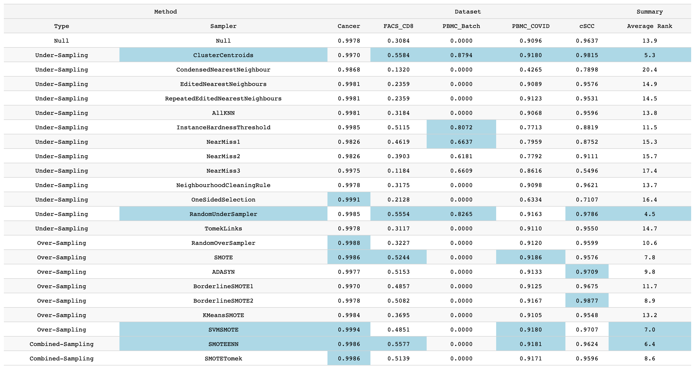

# Imbalanced Learning

## TODOS

1. Change RandomForestClassifier to MLP, and make the classifier optional
2. Make metrics optional
3. Make sampling methods optional
4. Compose the ## Sampling Methods, ## Metrics and ## Ranking Methods parts
5. Make preprocessing optional, maybe a `simple_process` function
6. The table should have flexible title, like "Trained with MLP"

## Steps

1. Preprocess the datasets
    + Steps:
        - For each train set, fit
          a [`PCA()`](https://scikit-learn.org/stable/modules/generated/sklearn.decomposition.PCA.html#sklearn.decomposition.PCA)
          and
          a [`MinMaxScaler()`](https://scikit-learn.org/stable/modules/generated/sklearn.preprocessing.MinMaxScaler.html#sklearn.preprocessing.MinMaxScaler)
          to reduce dimensionality and scale the data
        - For each corresponding test set, transform the data with fitted `PCA()`  and `MinMaxScaler()`
    + Purpose:
        - Make the following sampling converge faster

2. Train model with different samplers
    - Iterate over all samplers
    - With each sampler, iterate over all datasets
    - In each dataset do:
        1. Utilize this sampler to sample the train data
        2. Fit a MLP with the sampled data
        3. Predict on the whole test data with the trained MLP
        4. Record the metric

## Sampling Methods

1. [`Imbalanced learn`](https://imbalanced-learn.org/stable/user_guide.html#user-guide)

## Metrics

1. [`geometric_mean_score`](https://imbalanced-learn.org/stable/references/generated/imblearn.metrics.geometric_mean_score.html)

## Ranking Methods

1. Average

## Evaluation

1. For a sampler, record its metric for all datasets respectively
2. After all samplers are processed, rank the metric of them in each dataset, the highest has rank 1, the second has
   rank 2, and so on
3. Calculate the summary rank for each sampler
4. Output the results to a table
    - The k highest metric for every dataset are highlighted
    - The m samplers with highest rank are highlighted

5. Demo: 

## Summary

1. The Random methods often outperform
