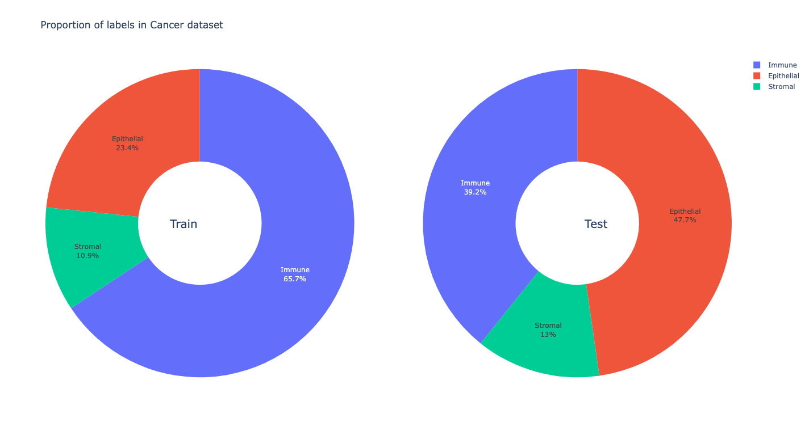
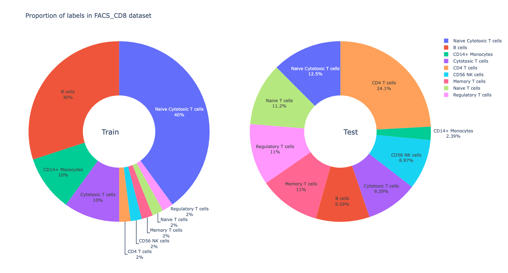
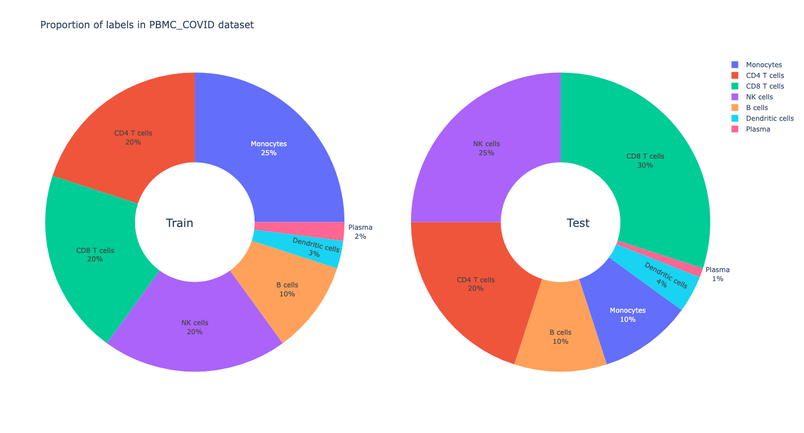
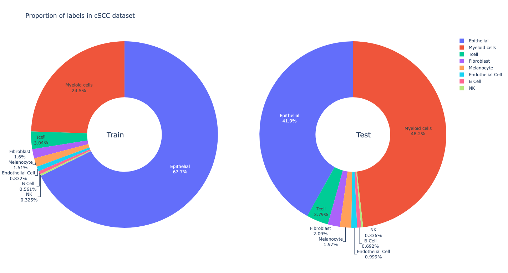
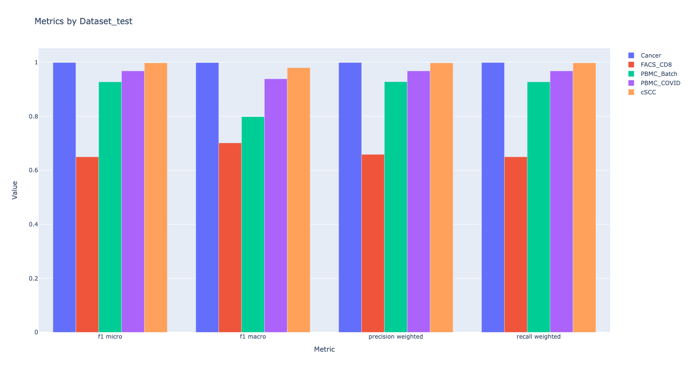

<div align="center">
 <h1><a href="https://github.com/metaboulie/fedorAop">Research Proposal</a></h1>
</div>

- [Background](#background)
- [Significance](#significance)
- [Exploratory Analysis](#exploratory-analysis)
- [Approach](#approach)
    - [Neural Network](#neural-network)
    - [Sampling](#sampling)
        - [Plan 1](#plan-1)
        - [Plan 2](#plan-2)
        - [Plan 3](#plan-3)
- [Future](#future)

## Background

1. Covariate Shift
   Inconsistency in the distribution of input features between training and testing data.
2. Label Shift
   The feature distribution is the same between training and testing data, but the label distribution has changed.
3. Concept Shift
   The concepts or tasks involved have changed between training and testing data.

## Significance

1. Enhance the model's generalization and efficiency in practical applications.
2. Improve the model's resistance to `Adversarial Attacks`.
3. Enhance the model's prediction accuracy under different shifts.

## Exploratory Analysis

- Calculate the frequencies of different cell categories in five training and test sets, and create pie charts. It is
  observed that all datasets involve label shift.

<div align="center">

</div>

- Calculate the means of various genes for different cell categories in five training and test sets and create line
  charts. Dark colors indicate similar means between the training and test sets, while light blue and red represent
  differences. The results show that differences are not significant in all five datasets, and the line chart for
  the `Cancer` dataset is provided as a reference.

**Conclusion**

The main issue in the five datasets is ==label shift==, so models will be trained to address this phenomenon.

## Approach

> > _How to resist label shift_

### Neural Network

- Utilize the [**PyTorch**](https://pytorch.org/docs/stable/nn.html) API to build the model.

> ## _Architecture_
>> #### _Input and Embedding layers_
>
>> > **Linear** (`in_features`=n_features, `out_features`=n_features, `bias`=True)
>
>> > **Linear** (`in_features`=n_features, `out_features`=300, `bias`=True)
>
>> #### _MLP_
>
>> > **Linear** (`in_features`=300, `out_features`=\_inter_features, `bias`=True)
>
>> > **BatchNorm1d** (`batch_size`=\_inter_features, `eps`=1e-05, `momentum`=0.1, `affine`
> > > =True, `    track_running_stats`=True)
> > > **ELU** (`alpha`=1.0)
> > > **Dropout** (`p`=0.5, `inplace`=False)
>
>> > **Linear** (`in_features`=\_inter_features, `out_features`=\_inter_features, `bias`=True)
>
>> > **BatchNorm1d** (`batch_size`=\_inter_features, `eps`=1e-05, `momentum`=0.1, `affine`=True, `track_running_stats`
> > > =True)
> > > **ELU** (`alpha`=1.0)
> > > **Dropout** (`p`=0.5, `inplace`=False)
>
>> > **Linear** (`in_features`=\_inter_features, `out_features`=n_labels, `bias`=True)
>
>> > **Softmax** (`dim`=1)
>
>> #### _Optimizer_
>>
>> > **Adam** (`lr`=LR, `betas`=(BETA1, BETA2), `eps`=EPS)
>>
>> #### _Loss Function_
>>
>> > **CrossEntropyLoss**
>>
>> #### _Learning-rate Scheduler_
>>
>> > **ReduceLROnPlateau** ("min", `patience`=PATIENCE, `threshold`=THRESHOLD)

- `_inter_features` = $\frac 23$ (`in_features`+`out_features`)
- `nEpoch` = 10

### Sampling

> > _For BGD_ _@property@abstractmethod_

#### Plan 1

Generate probabilities (default is standard Gaussian distribution) for all samples in the training set based on these
probabilities (weights), and sample the data.

```python
def sample(self) -> tuple[torch.Tensor, torch.Tensor]:
    """Use the generated weights to sample the data

    Returns
    -------
    tuple[torch.Tensor, torch.Tensor]
        X_Batch, y_Batch
    """
    self.weights = prosGenerator(distribution=self.distribution, size=self.size)

    self.choices = np.random.choice(
        range(self.size), self.batch_size, False, self.weights
    )

    return featureLabelSplit(self.data[self.choices])
```

- Results

<div align="center">  </div>

- Performs poorly on `FACS_CD8` and `PBMC_Batch` datasets.

#### Plan 2

Randomly divide the number of samples to be extracted into n groups, where n is the number of different labels in the
dataset. The number of samples in each group corresponds to the number of samples sampled by Bootstrap for each label.

```python
def sample(self) -> tuple[torch.Tensor, torch.Tensor]:
    """Utilize the generated counts to sample the data by Bootstrap

    Returns
    -------
    tuple[torch.Tensor, torch.Tensor]
        X_Batch, y_Batch
    """
    nums = self.getNum  # A property returns the nums to be sampled for each label
    for i in range(len(self.changeIndexes) - 1):
        self.choices += list(
            np.random.choice(
                range(self.changeIndexes[i], self.changeIndexes[i + 1]),
                nums[i],
                True,
            )
        )
    return featureLabelSplit(self.data[self.choices])
```

- Results

<div align="center">  </div>

- Improvement compared to Plan 1 but still performs poorly on `FACS_CD8` and `PBMC_Batch` datasets.

#### Plan 3

Impute samples using the mean and standard deviation of data for each label in the training set.

```python
def iterLabels(self):
    """Iterate each label, and impute data"""
    for i in range(len(self.changeIndexes) - 1):
        numOfImputation = (
            self.maxNum - self.changeIndexes[i + 1] + self.changeIndexes[i]
        )
        labelMean, labelStd = self.featureStatsAgg(labelCounter=i)
        imputedData = self.imputeData(i, numOfImputation, labelMean, labelStd)
        self.data = np.concatenate((self.data, imputedData), axis=0)
    self.size = self.data.shape[0]


def sample(self):
    """Sample the balanced dataset

    Returns
    -------
    tuple[torch.Tensor, torch.Tensor]
        X_Batch, y_Batch
    """
    self.choices = np.random.choice(range(self.size), self.batch_size, True)
    return featureLabelSplit(self.data[self.choices])
```

- Results

<div align="center">  </div>

- Compared to Plan 2, there is an improvement on `FACS_CD8` but worse performance on `PBMC_Batch` dataset.

## Future

1. Combine various sampling plans.
2. Deploy simpler models for datasets with better performance to save costs.