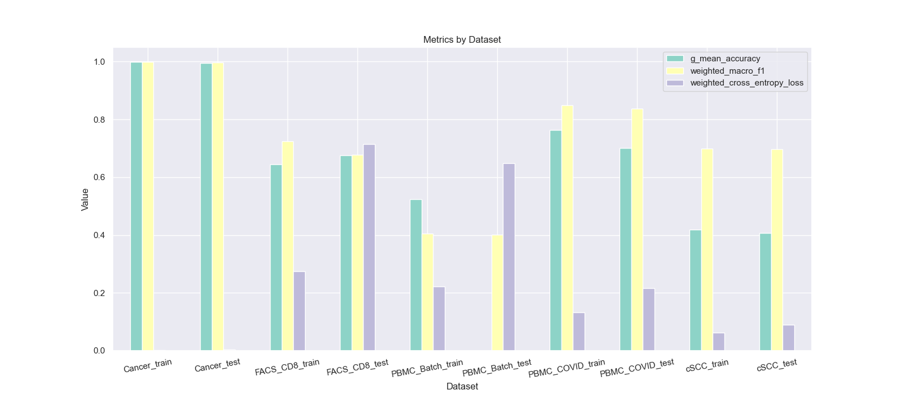
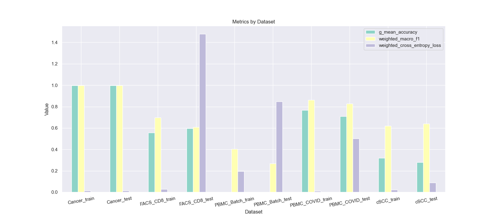

# Combining Sampling Methods, Neural Networks and Cost-Sensitive Learning

## Method 4

1. Utilize `SampleWithImputation` sampling method.
    - Use the information given by the training data to impute data and make training data balanced
    - In every training step, random sample data from the manipulated data
2. Utilize `NeuralNetwork` neural network.
    - In this case, `CrossEntropyLoss` without weights is better than `CrossEntropyLoss` with weights, and will speed up
      training a lot
3. Utilize `cost_sensitive` cost-sensitive learning.
    - Determine the Cost Matrix using the following principle:
        + $C(j,k) = \frac {n_j}{n_k} \quad with \ n_k \ll n_j$
        + $C(j,k) = 1 \quad with \ n_j \ll n_k$
        + $C(j,k) = 0 \quad\text {for a correct classification}$

Result

## Method 5

1. Utilize `RandomUnderSampler` sampling method.
2. Utilize `NeuralNetwork` neural network with `WeightedCrossEntropyLoss`.
3. Utilize `cost_sensitive` cost-sensitive learning.

Result

## Evaluation

1. [`G-Mean Accuracy`](https://imbalanced-learn.org/stable/references/generated/imblearn.metrics.geometric_mean_score.html)
2. Weighted macro $F_1$ score:
    - For imbalanced data sets, give more weights to minority classes
    - $w_1,\dots,w_g \in [0,1] \; \text {such that} \; w_i > w_j \; \text {if} \; n_i < n_j \; \text {and} \;
      \displaystyle \sum _{i=1}^gw_i = 1$

      $$
      \rho _\textit{wmMETRIC} = \frac 1g\displaystyle\sum_{i=1}^g\rho_{\textit{METRIC}_i}w_i
      $$

      where $\textit{METRIC}_i$ is a class-specific metric such as $\textit{PPV}_i, \; \textit{TPR}_i$ of class *i*

    - Example: $w_i = \displaystyle\frac{n-n_i}{(g-1)n}$ are suitable weights
    - Weighted macro $F_1$ score:

      $$
      \rho_{\textit{wmF}_1} = 2 \cdot \displaystyle\frac{\rho_\textit{wmPPV} \cdot \rho_\textit{wmTPR}}{\rho_
      \textit{wmPPV}+\rho_\textit{wmTPR}}
      $$
3. Weighted `CrossEntropyLoss`