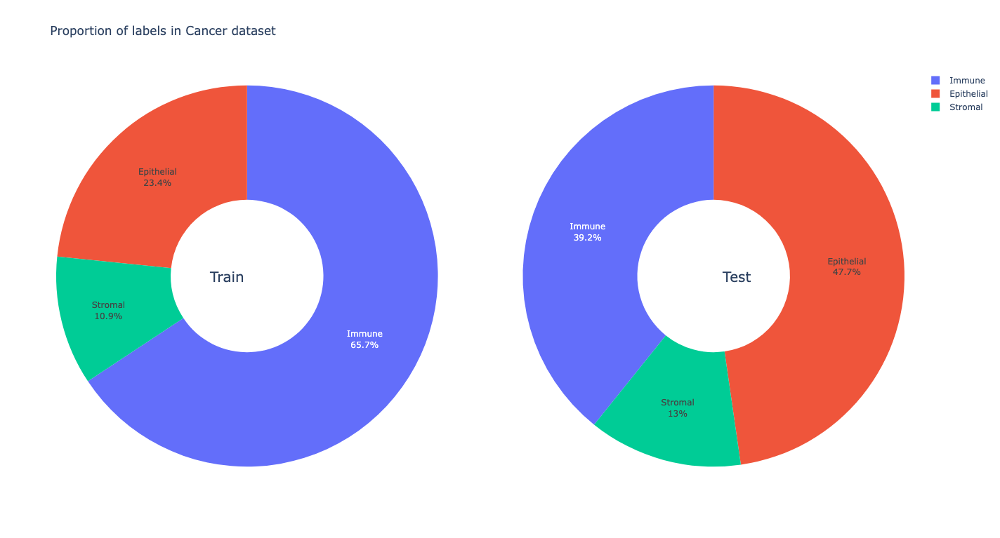
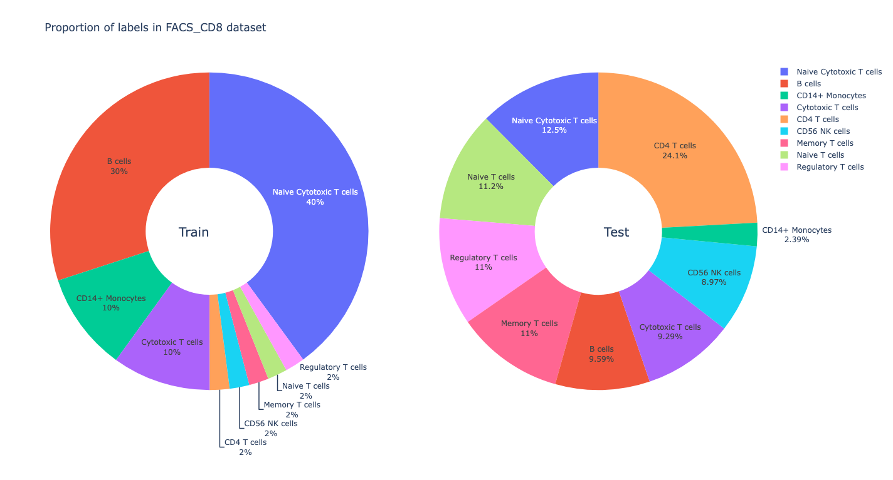
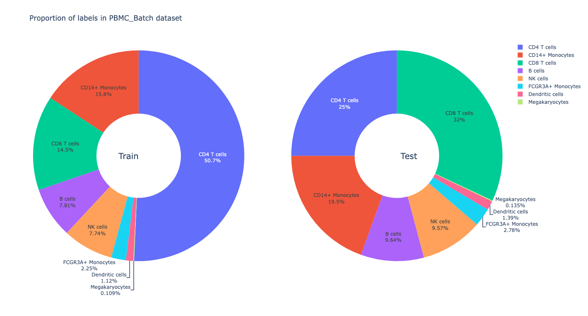
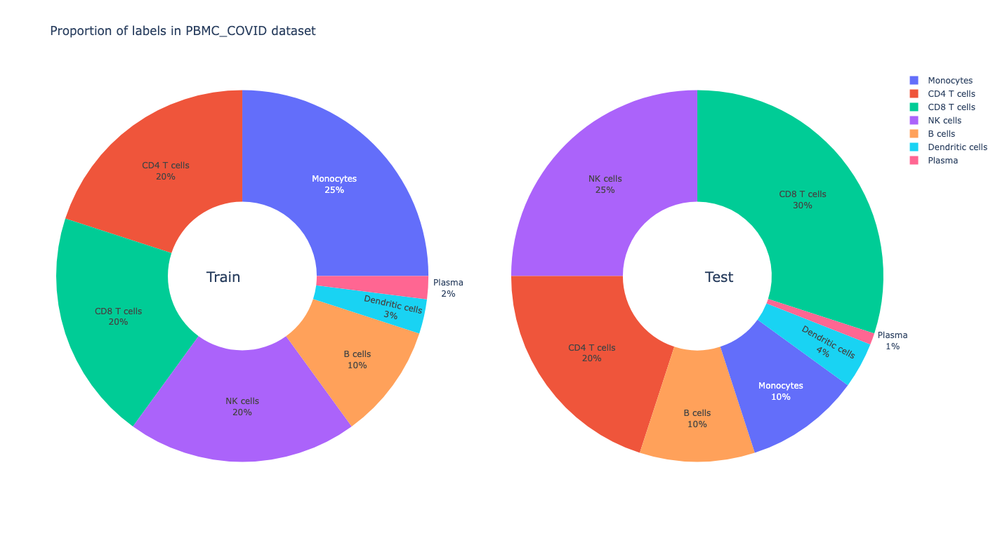
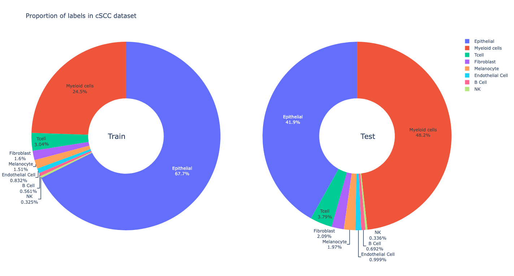
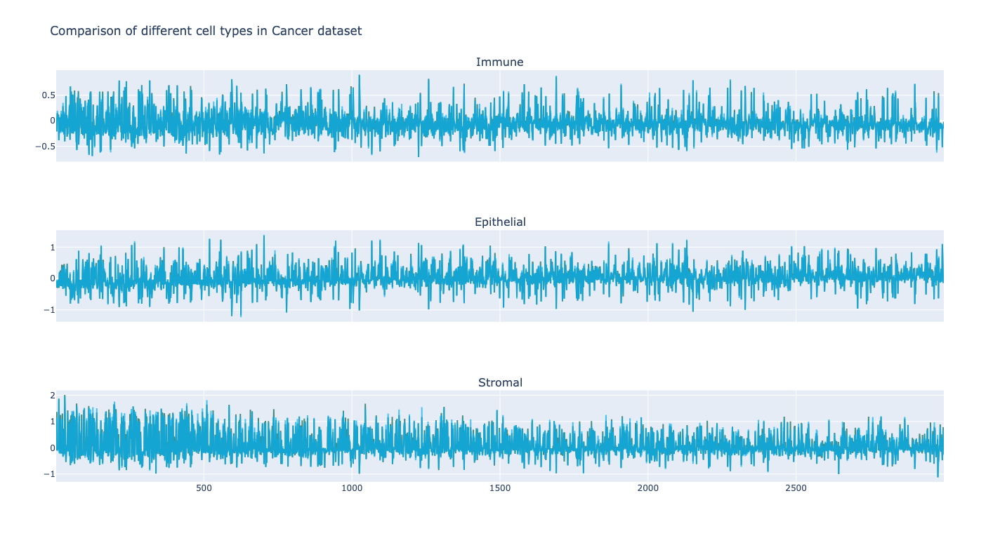
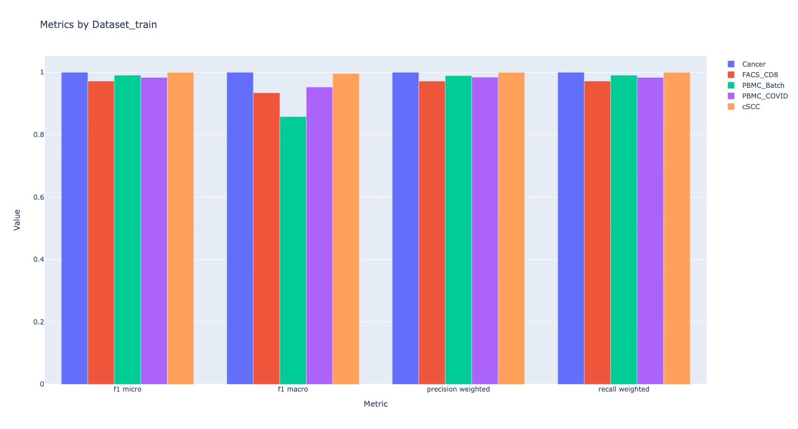
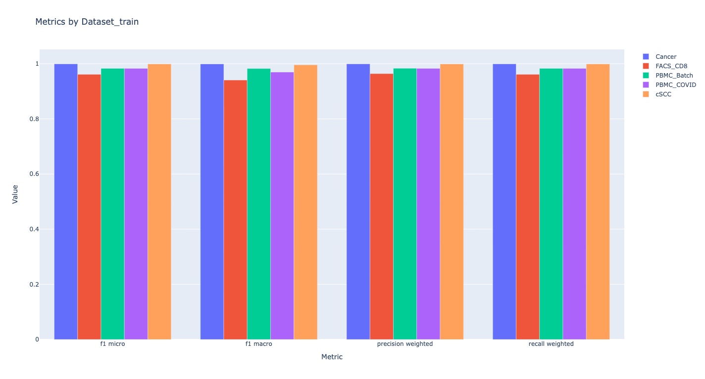
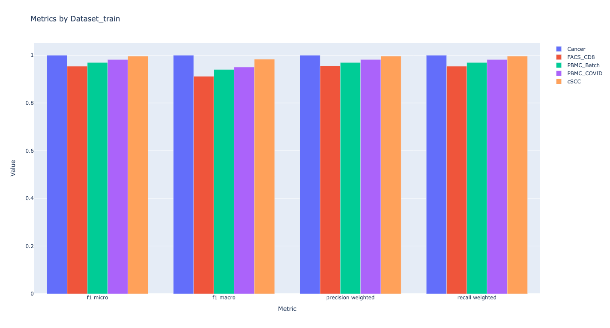
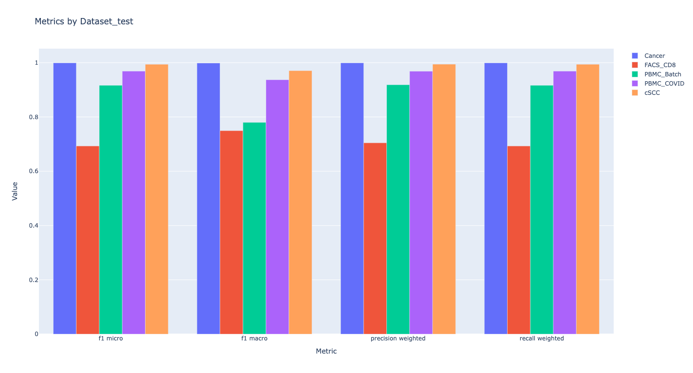

<div align="center">
 <h1><a href="https://github.com/metaboulie/fedorAop">Research Proposal</a></h1>
</div>

> 王梓奕 李一玄 刘俊豪 姚嘉浩 黄肖炜

- [背景](#背景)
- [意义](#意义)
- [探索性分析](#探索性分析)
- [思路](#思路)
  - [神经网络](#神经网络)
  - [抽样](#抽样)
    - [方案 1](#方案-1)
    - [方案 2](#方案-2)
    - [方案 3](#方案-3)
- [未来](#未来)

## 背景

1. 协变量偏移
   训练数据和测试数据中的输入特征的分布不一致
2. 标签偏移
   训练数据和测试数据的特征分布相同，但标签分布发生了变化
3. 概念偏移
   在训练数据和测试数据之间，涉及到的概念或任务发生了变化

## 意义

1. 提高模型在实际应用中的泛化能力及效率
2. 提高模型对 `Adversarial Attack` 的抵御力
3. 提高模型在不同偏移下的预测准确性

## 探索性分析

- 统计五组训练集和测试集中各类别细胞的频率，绘制饼图，可看出各数据集均涉及标签偏移
<div align="center">

</div>
- 统计五组训练集和测试集中各类别细胞各基因的均值，绘制折线图，深色代表训练集与测试集的均值相近，浅蓝色与红色则代表该基因下均值存在差异， 结果发现在五组数据集中差异均不显著，给出`Cancer`数据集的折线图作为参考

**结论**

五组数据集主要问题在于较为严重的标签偏移，因此针对该现象训练模型并拟合

## 思路

> > _How to resist label shift_

### 神经网络

- 调用 [**PyTorch**](https://pytorch.org/docs/stable/nn.html) 的 API 建立模型

> ## _Architecture of Neural Network_
>
> > ### **_Input and Embedding layers_**
> >
> > > **Linear** (`in_features`=n_features, `out_features`=n_features, `bias`=True)
>
> > > **Linear** (`in_features`=n_features, `out_features`=300, `bias`=True)
>
> > ### **_MLP_**
> >
> > > **Linear** (`in_features`=300, `out_features`=\_inter_features, `bias`=True)
>
> > > **BatchNorm1d** (`batch_size`=\_inter_features, `eps`=1e-05, `momentum`=0.1, `affine`=True, `    track_running_stats`=True)
> > > **ELU** (`alpha`=1.0)
> > > **Dropout** (`p`=0.5, `inplace`=False)
>
> > > **Linear** (`in_features`=\_inter_features, `out_features`=\_inter_features, `bias`=True)
>
> > > **BatchNorm1d** (`batch_size`=\_inter_features, `eps`=1e-05, `momentum`=0.1, `affine`=True, `track_running_stats`=True)
> > > **ELU** (`alpha`=1.0)
> > > **Dropout** (`p`=0.5, `inplace`=False)
>
> > > **Linear** (`in_features`=\_inter_features, `out_features`=n_labels, `bias`=True)
>
> > > **Softmax** (`dim`=1)
> >
> > ### **_Optimizer_**
> >
> > > **Adam** (`lr`=LR, `betas`=(BETA1, BETA2), `eps`=EPS)
> >
> > ### **_LossFuntion_**
> >
> > > **CrossEntropyLoss**
> >
> > ### **_Learning-rate Scheduler_**
> >
> > > **ReduceLROnPlateau** ("min", `patience`=PATIENCE, `threshold`=THRESHOLD)

- `_inter_features` = $\frac 23$ (`in_features`+`out_features`)
- `nEpoch` = 10

### 抽样

> > _For BGD_ _@property@abstractmethod_

#### 方案 1

使用一种概率分布 (默认为标准高斯分布) 为训练集中的所有样本生成一个概率 (权重)，基于这些权重抽取样本

```python
def sample(self) -> tuple[torch.Tensor, torch.Tensor]:
    """Use the generated weights to sample the datasuperClass Sample

    Returns
    -------
    tuple[torch.Tensor, torch.Tensor]
        X_Batch, y_Batch
    """
    self.weights = prosGenerator(distribution=self.distribution, size=self.size)

    self.choices = np.random.choice(
        range(self.size), self.batch_size, False, self.weights
    )

    return featureLabelSplit(self.data[self.choices])

```

- 结果
<div align="center">

</div>
- 在 `FACS_CD8` 与 `PBMC_Batch` 上表现很差

#### 方案 2

将要抽取的样本数随机分为 n 组，其中 n 为数据集中不同标签个数，每组中的样本数对应于各个标签中采用 Bootstrap 采样的样本数

```python
def sample(self) -> tuple[torch.Tensor, torch.Tensor]:
    """Utilize the generated counts to sample the data by Bootstrap

    Returns
    -------
    tuple[torch.Tensor, torch.Tensor]
        X_Batch, y_Batch
    """
    nums = self.getNum  # A property returns the nums to be sampled for each label
    for i in range(len(self.changeIndexes) - 1):
        self.choices += list(
            np.random.choice(
                range(self.changeIndexes[i], self.changeIndexes[i + 1]),
                nums[i],
                True,
            )
        )
    return featureLabelSplit(self.data[self.choices])
```

- 结果
<div align="center">

</div>

- 相比方案 1 有提升但在 `FACS_CD8` 与 `PBMC_Batch` 上表现依然很差

#### 方案 3

利用训练集中各标签下数据的均值及标准差伪造样本并植入到训练集中

```python
def iterLabels(self):
    for i in range(len(self.changeIndexes) - 1):
        numOfImputation = (
            self.maxNum - self.changeIndexes[i + 1] + self.changeIndexes[i]
        )  # * The number of the data to be imputed equals self.maxNum minus the count of observations of this label
        labelMean, labelStd = self.featureStatsAgg(labelCounter=i)
        imputedData = self.imputeData(i, numOfImputation, labelMean, labelStd)
        self.data = np.concatenate((self.data, imputedData), axis=0)
    self.size = self.data.shape[0]  # Update the size of the data

def sample(self):
    self.choices = np.random.choice(range(self.size), self.batch_size, True)
    return featureLabelSplit(self.data[self.choices])
```

- 结果
<div align="center">

</div>
- 相比方案 2 在 `FACS_CD8` 上有提升但在 `PBMC_Batch` 上表现更差

## 未来

1. 混合各个抽样方案
2. 对表现较好的数据集部署更简单的模型以节省成本
